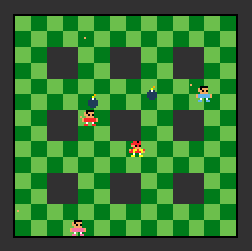

# **Bomberman 1984 - Edição Assembly MIPS**

Este projeto é uma recriação do clássico jogo **Bomberman (1984)**, desenvolvido em **Assembly MIPS** utilizando o simulador **MARS**. Criado por [**Isaac Lira**](https://github.com/IsaacLira42) e [**Lucas Vinícius**](https://github.com/viniciusgois711), o projeto une aprendizado e diversão ao resgatar elementos essenciais de um dos jogos mais marcantes da história dos videogames.

## 🖼️ **Gameplay**



## 🎮 **Características do Jogo**

* Estilo **retrô inspirado** no original de 1984.
* 💣 **Explosões e estratégia**: posicione bombas para abrir caminhos e eliminar inimigos.
* 🕹️ **Controles simples**, via teclado.

## 🎯 **Objetivos do Jogador**

1. **Mover o personagem** pelo labirinto.
2. **Colocar bombas** de forma estratégica para eliminar inimigos.
3. **Evitar ser atingido** pelas explosões ou pelos inimigos.

## 📚 **Aprendizados e Desafios**

Este projeto foi uma ótima oportunidade para:

* Aprofundar conhecimentos em **Assembly MIPS**.
* Trabalhar com **controle de fluxo** e movimentação no mapa.
* Gerenciar **eventos** como explosões e colisões.
* Criar uma **interface gráfica simples**, usando o **Bitmap Display** do MARS.

## ▶️ **Como Executar**

1. Instale o simulador **MARS MIPS**:
   🔗 [https://github.com/dpetersanderson/MARS/](https://github.com/dpetersanderson/MARS/)

2. Clone este repositório:

   ```bash
   git clone https://github.com/IsaacLira42/Bomberman1984
   ```

3. Abra o arquivo `.asm` no MARS.

4. Execute o programa e aproveite o jogo!

## 🤝 **Contribuidores**

* [**Isaac Lira**](https://github.com/IsaacLira42)
* [**Lucas Vinícius**](https://github.com/viniciusgois711)

Sinta-se à vontade para enviar feedbacks ou sugerir melhorias! 🚀